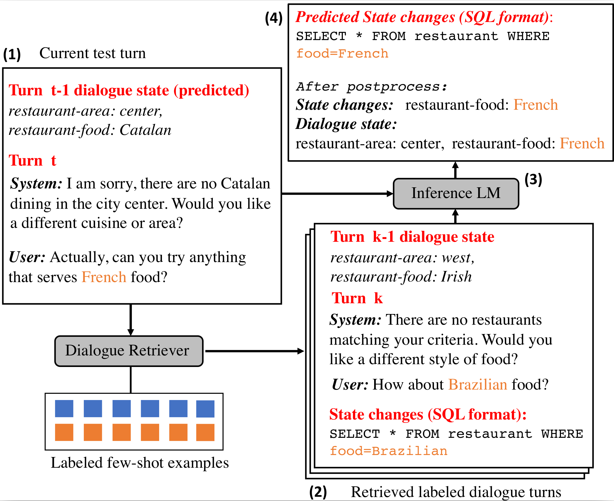

# IC-DST: In-Context Learning for Dialogue State Tracking with GPT-3

This is the pytorch implementation of
**In-Context Learning for Few-Shot Dialogue State tracking**. 

[**Yushi Hu**](https://yushi-hu.github.io/), Chia-Hsuan Lee, Tianbao Xie, Tao Yu, Noah A. Smith, and Mari Ostendorf. 
[[PDF]](https://arxiv.org/abs/2203.08568)

Findings of EMNLP 2022. Long Paper

Please use the bibtex below:
<pre>
@article{hu2022context,
  title={In-Context Learning for Few-Shot Dialogue State Tracking},
  author={Hu, Yushi and Lee, Chia-Hsuan and Xie, Tianbao and Yu, Tao and Smith, Noah A and Ostendorf, Mari},
  journal={arXiv preprint arXiv:2203.08568},
  year={2022}
}
</pre>


## Model Overview


The task is to track the slot values associated with a user request up to the current turn (dialogue state).

In few-shot settings,
given a test turn, IC-DST first retrieves a few most similar turns from the labeled dialogues as examples. 
The task schema (not shown in the figure), examples, 
and the test dialogue turn are concatenated in the prompt to a pretrained LM (for this repo, we use GPT-Neo, CodeGen, or GPT-3 Codex) to produce the current turn dialogue state changes as a SQL query.


## Environment
Besides PyTorch and Huggingface transformers, install the other requirements by
```console
pip install -r requirements.txt
```
(optional) Set up CodeGen by
```console
./install_codegen.sh
```

(optional) Put your OpenAI API key in `config.py` to use GPT-3. (Codex is under private Beta now, you can easily request it on OpenAI's offical website and try it for free!)
Skip this step if you only want to run on GPT-Neo and CodeGen.

## Quick Start
A simple demo is in `demo.ipynb`, following the prompt example in the Appendix of the paper.

## Data
We follow the pipeline of [MultiWoz 2.4 repo](https://github.com/smartyfh/MultiWOZ2.4/) for data preprocessing.
We modified a bit to unify the ontology between MultiWOZ 2.1 and 2.4
To download and create the dataset
```console
cd data
python create_data.py --main_dir mwz21 --mwz_ver 2.1 --target_path mwz2.1  # for MultiWOZ 2.1
python create_data.py --main_dir mwz24 --mwz_ver 2.4 --target_path mwz2.4  # for MultiWOZ 2.4
```

### preprocess the dataset
Run the following script to sample and preprocess the few-shot and full-shot training sets, dev set and test set. 
For few-shot experiments, the retriever is trained on the selection pool. So we have save the selection pool for each of the experiment.
`data/sample.py` samples and processes the training sets.
All the processed data will be saved in the `data` folder.
```console
./preprocess.sh
```

If you want to sample your own training set, follow this example:
to sample a 5% training set
```console
python sample.py --input_fn mwz2.1/train_dials.json --target_fn mw21_5p_train_seed0.json --ratio 0.05 --seed 0
```


## Retriever
The trained retrievers are saved in `retriever/expts` folder. Each subfolder is a trained retriever.

### retriever quickstart
If you want to skip the retriever finetuning etc. part, 
just download one of our retriever finetuned on 5% training set and try it.
Download and unzip [https://drive.google.com/file/d/12iOXLyOxvVuepW7h8h7zNj1tdIVNU76F/view?usp=sharing](https://drive.google.com/file/d/12iOXLyOxvVuepW7h8h7zNj1tdIVNU76F/view?usp=sharing), put the folder in `retriever/expts`.

### retriever details
Embed all the utterances with SBERT (all-mpnet-base-v2) by
```console
cd retriever/
python pretrained_embed_index.py
```
This will save all the embeddings in `retriever/expts/all_mpnet_base_v2`.

To finetune SBERT with data in `../../data/mw21_5p_v2.json`, run
```console
python retriever_finetuning.py \
--train_fn ../../data/mw21_5p_train_v2.json \
--save_name 5p_test \
--epoch 15 \
--topk 10 \
--toprange 200
```
This will save the embedding model and pre-embeded selection pool to `retriever/expts/5p_test`.

topk and toprange are hyperparameters for negative example sampling. Scale them with the selection pool size. For example, when using 1% training data, use topk=2, toprange=40; when using 5% training data, use topk=10, toprange=200.


## In-Context Learning Experiments

Given a selection pool and a retriever, to run an in-context learning experiment, for example, using `data/mw21_5p_train_v2.json` as selection pool, use `retriever/expts/mw21_5p_v2` as the retriever (already trained with the selection pool), and saving all the results and running logs to `expts/codex_5p_v2`, and evaluate on the MultiWOZ 2.1 test set:
```console
python run_codex_experiment.py \
      --train_fn data/mw21_5p_train_v2.json \
      --retriever_dir retriever/expts/mw21_5p_v2 \
      --output_dir expts/codex_5p_v2  \
      --mwz_ver 2.1
```
Notice that this will generate a json file `expts/codex_5p_v2/running_log.json`. This files contains all the prompts and codex completion, and can be used in further analysis. We have put the sample running log there for analysis.

To run the experiment with GPT-Neo 2.7B, use `run_gpt_neo_experiment.py` rather than `run_codex_experiment.py`. To run with CodeGen-Mono 2.7B, use `run_codegen_experiment.py`. Everything else is the same.

### Analyze using the running log

Notice that the only difference between MultiWOZ 2.1 and 2.4 are the labels of dev and test set. So, there is no need to run the same experiment again for 2.1 and 2.4. Instead, we can get the MultiWOZ 2.4 scores with the running log on MultiWOZ 2.1. Continue with the above example, we can get 2.4 scores by
```console
python evaluate_run_log.py --running_log expts/codex_5p_v2/running_log.json --test_fn data/mw24_100p_test.json --mwz_ver 2.4
```

### Zero-shot experiment
Run the zero-shot experiment on MultiWOZ 2.1 by
```console
python run_zeroshot_codex_experiment.py --output_dir ./expts/zero-shot --mwz_ver 2.1
```

Get the per-domain result on MultiWOZ 2.1 by
```console
python evaluate_run_log_by_domain.py --running_log expts/codex_5p_v2/running_log.json --test_fn data/mw24_100p_test.json --mwz_ver 2.1
```

To get result on MultiWOZ 2.4, change to `--mwz_ver 2.4`.
